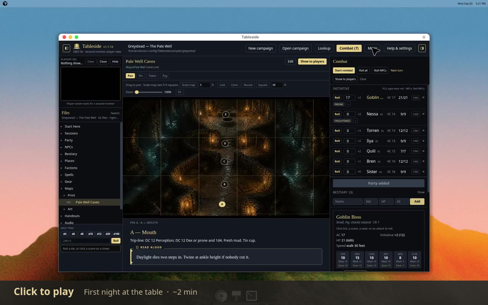

# How to use Tableside

Step-by-step for a night at the table. Current release: **1.8.10**.

Tableside is a **local Windows DM console for the laptop at your table**. People sit together in the room; a second monitor (TV) shows players a clean picture — maps, art, initiative, or a sci-fi opening crawl. It is **not** a full virtual tabletop for online play. There is no account and no internet required once the app is installed.

**Watch first** (about two minutes, Greystead sample):

[](media/how-to-use.mp4)

[Watch the video](media/how-to-use.mp4) (~2 min). GitHub does not play MP4 files inline on markdown pages — click the picture or the link. The sections below are the same night, pause-and-read.

| Time | What you see |
| --- | --- |
| 0:03 | Map tools on Pale Well Caves |
| 0:19 | Open tonight’s game night sheet from Files |
| 0:38 | Read-aloud, combat, and treasure on the sheet |
| 0:58 | Combat roster, then back to the map |
| 1:18 | Show the map to the player TV |
| 1:33 | Lookup wolf in the offline system pack |

Deeper reference: [TABLE.md](TABLE.md) (every control), [CAMPAIGN.md](CAMPAIGN.md) (folder layout), [RECIPES.md](RECIPES.md) (short workflows), [MARKDOWN.md](MARKDOWN.md) (note syntax).

## Install

1. Download **[Tableside-Setup-1.8.10.exe](https://github.com/AxiumDND/tableside/releases/latest)**.
2. Run it. Per-user install — Start Menu + desktop shortcut. No admin.
3. If Windows says **Windows protected your PC**, click **More info**, then **Run anyway**. The installer is not code-signed. That is expected.
4. Open **Tableside**.

Installed copies check GitHub at launch. By default they only offer the latest stable release. Nothing downloads until you press **Install**. Help → Updates has **Include test (beta) updates** if you want Pre-releases. Offline, the app stays quiet.

## First launch

With no campaign yet, Tableside copies **Greystead — The Pale Well** (a level-1 5e one-shot) into your user data and opens it. **Sample** does the same later. Edits there are safe; they do not write back into the installer.

| Button | What it does |
| --- | --- |
| **Sample** | Open the bundled Greystead one-shot |
| **Open campaign** | Pick any folder on disk |
| **New campaign** | Pick a system (D&D 5e, Pathfinder 2e, or Vampire 5th), a look, then an empty folder |

**Open** reads any folder and fills in missing standard folders. Folders without `"system"` in `campaign.json` run as D&D 5e. You can change the **look** later (Classic, Light, Sci-fi, Vampire, Cyberpunk, Digital rain) from **Help & settings** or **Start Here**. You cannot change the system pack mid-campaign.

## The two windows

| Window | What it is for |
| --- | --- |
| **DM console** | Notes, combat, music, Tools, dice. Only you see this. |
| **Player view** | Fullscreen on the TV. Picture, map (crop / fog / tokens), initiative overlay, or crawl. Black when idle. |

Click the left **Players see** preview to place the player window on the table TV. **Close** on that preview shuts the player window so you can use the TV for something else. **Show to players** or picking a monitor opens it again.

**Clear** (header, preview, or `Alt+X`) blanks the TV. It does **not** stop music.

## A typical night

### 1. Open tonight’s notes

The left **Files** list is your campaign folder. Click a note to open it in the center.

- Folders start collapsed. Opening a file expands its folder.
- Click the search icon next to Files, or press `Ctrl+F` / `/`, to find a note by name. `Esc` clears, then hides the box.
- **← Back**, `Alt+←`, or the mouse back button returns to the previous note.

Right-click a folder to create a player, party roster, NPC, monster, spell, gear, game night sheet, session recap, map, place, shop, or faction. On a Party, NPC, or monster sheet, **Add web sheet** stores a character or monster page URL; **Show web sheet** / **Show note** flip between the live page and the campaign note (sign in on that page if asked). **Add art…** copies pictures into that folder’s `Art/`. Name art like the sheet (`Ghoul.webp`) so portraits attach.

### 2. Show a picture

1. Open a note that embeds `![[image.png]]`, or click an image in the file tree.
2. Click the picture so it is selected.
3. Press **Show to players** (`Alt+S`). The TV fades in over about five seconds.
4. **Clear** (`Alt+X`) when you are done.

PDFs open for you only. They are not sent to the TV. Use an image under `Maps/Art/` (or a screenshot) if the players should see it.

### 3. Run a map

1. Right-click **Maps/** → **New map…**. Pick an existing campaign image or **Load image…** (copied into `Maps/Art/` and named like the note).
2. The map fills the center. Tools: **Pan**, **Pin**, **Token**, **Fog**. Extra options sit under the selected tool.
3. On **Pan**, click **Scale map**, then two points that are 5 feet apart (or type another length). Tokens snap to that 5 ft grid.
4. **Line**, **Cone**, **Round**, and **Square** drop a feet-sized template on that grid (default 30 ft). Click origin and drag to aim; **Round** is a radius at the click; **Square** is a cube centered on the click. Esc clears. Templates stay on the DM map only.
5. Scroll to zoom. Drag to pan.
6. **Pins** are DM-only. **Tokens** (Party / NPCs / Bestiary portraits) and **fog** show on the TV.
7. **Show to players**. The TV follows as you zoom, pan, paint fog, or move tokens.

Large and Huge tokens stay 2× / 3× a Medium token.

### 4. Start a fight

Prep on a **game night sheet** (right-click **Sessions/** → **New game night sheet…**):

1. **The Party** — a `[!party]` block with linked PC sheets (and any companion `[[NPC]]` lines) plus a **Focus tonight** note. Read mode shows race, class, AC, HP, and passive perception from those sheets.
2. **Scenes** — Opening scene block, then more `[!scene]` blocks (copy one to add a beat). Each can have art, read-aloud, GM-only notes, optional secrets/treasure/NPCs, nested `[!combat]` fights, and **At the table** cues (place, map, checks, music, sound, leads to).
3. Combatants for a fight **inside a `[!combat]` block** nested in the scene (or at document level):

```markdown
[!scene] The door
…
[!combat] Combat 1 — the door
**Combatants:** [[Cultist]] ×3 · party
[!/combat]
[!/scene]
```

Include `party` unless PCs are not in the fight. Prefer real Bestiary / NPC stems. On the card, **Edit** opens a structured roster: Party toggle, foe counts, and **Add combatant…** (NPCs, Bestiary, SRD/books — missing monsters land in `Bestiary/`).

Treasure in a scene uses `[!treasure]` — **Edit** for coin boxes and **Add item…** (Gear / SRD / books). Currencies live under **Help & settings → Currencies**.

At the table:

1. Open the sheet. Press **Add to initiative** on that combat section.
2. Open **Combat** in the header if it is not already open.
3. Type PC initiative from the table. NPCs at 0 are rolled for you. Use **Roll all** / **Roll NPCs** if you need to re-roll.
4. **Start combat**, then advance turns (`Alt+T`). Click **Cnd** on a row to toggle conditions (Poisoned, Prone, and the rest of the pack). With **Combat music** ticked, Start combat plays `Audio/Music/Combat`.
5. Optionally **Show to players** on the Combat panel to overlay order on the current picture. Players see names, pack tags (5e Bloodied / 0 HP; PF2e Wounded / Dying; V5 Health, Willpower, Hunger), and any conditions you set. They never see HP numbers.
6. **End combat** empties the tracker (asks first). With **Combat music** ticked, it returns to `Audio/Music/General`. Untick Combat music if you want to leave the mixer alone.

**Add all players** loads every `Party/` sheet. Lookup monsters can **Add to combat** for this fight only.

Combat saves in hidden `combat.json` until you End combat.

After the session, right-click **Sessions/** → **New session recap…** for notes on what actually happened. Secrets and next-prep go in `[!gmonly]`. Prep stays on the game night sheet. Right-click **Party/** → **New party roster…** for a standing list of who is travelling together (companions stay in `NPCs/` and are linked in the same `[!party]` block).

### 5. Play music

Tableside does not include music. Drop files you own, or use **Add audio…** on each strip.

| Folder | What it is |
| --- | --- |
| `Audio/Music/Combat` | Fight playlist (also starts from **Start combat** when Combat music is ticked) |
| `Audio/Music/Creepy` | Tension playlist |
| `Audio/Music/General` | Town / travel playlist (also resumes from **End combat** when Combat music is ticked) |
| Extra folders under `Audio/Music/` | Extra moods |
| `Audio/Ambience/` | Looping beds (crowd, rain). Folders or loose files |
| `Audio/Sfx/` | Soundboard one-shots. Subfolders become headings |

Accepted: `.mp3` `.ogg` `.wav` `.m4a` `.flac` `.webm` `.aac`. Files sitting in `Audio/` itself are ignored.

1. Click **Music** in the header.
2. Pick **Output** (laptop, HDMI TV, headset). The mix uses that device whether the player view is open or closed.
3. Pick a **mood**. Choose **In order** or **Shuffle** (that mood only).
4. **Play** starts. **Pause** holds the track and the timer. **Skip** stays in that mood. **Stop** ends the track; Play starts the mood again from the beginning.
5. Pick an ambience bed, then **Start** / **Stop**. One bed at a time.
6. Click a soundboard button for a one-shot. Several can overlap.
7. **Stop all** fades music and ambience.

**Now playing** shows the track, elapsed time, and length. Volumes and the last mood save in hidden `audio.json`. Opening a file in the tree is a DM preview only — it does not drive the mix.

### 6. Opening crawl (Sci-fi look)

Write your own words. Tableside does not include licensed crawl text, logos, or music.

1. Set the campaign look to **Sci-fi** (Help & settings or Start Here).
2. In any note, add:

```markdown
> [!crawl] The Siege of Kestrel
> preface: In an age before memory, beyond the rim of charted stars.
> ![[Title Mark.png]]
> It is a time of unrest. Relay stations along the outer belt have gone dark.
```

3. Edit title, far-off line, emblem, crawl music, and crawl on the card — they write back into the note.
4. `preface: none` skips the far-off line. Omit `![[…]]` to use the generic emblem.
5. Optional **Crawl music** — pick a track under `Audio/Music/`, or **Load audio…** into `Audio/Music/Crawl/`. On **Play**, that track overrides the mood playlist; when it ends (or you **Clear**), the previous mood resumes.
6. **Play** on the card. The TV shows stars, then the far-off line, the emblem, then a perspective crawl.
7. **Clear** or `Alt+X` stops the picture and restores mood music.

Other looks still show the card so the note stays readable. Play stays disabled until the look is Sci-fi. New sci-fi campaigns get a sample crawl on the game night sheet — rewrite it.

### 7. Look something up

**Tools → Lookup** searches the open campaign’s system pack offline.

| Pack | What you get |
| --- | --- |
| D&D 5e | Bundled SRD 5.2.1 (conditions, spells, monsters, weapons, rules) |
| Pathfinder 2e | Small original core |
| Vampire 5th | Original table procedures |

Filter chips narrow the category. From a result you can **Add to combat** (monsters) or **Add to Bestiary / Spells / Gear** (writes a campaign note you can edit and wikilink). On 5e, adding a monster also copies its default portrait into `Bestiary/Art/` if you do not already have one.

Optional PHB / DMG text dumps go in the app `Additional Books/` folder — not in the campaign. Details: [Additional Books/README.md](../Additional%20Books/README.md). Use the **Additional books** link in Lookup.

**Tools → NPC** rolls a few names from race (5e) or ancestry (Pathfinder 2e), with a **Name flavor** picker (Classic fantasy, Norse, Greek mythology, Celtic, Roman, Arabic / desert-fantasy, Slavic, East Asian–inspired). Vampire uses name tradition instead. Copy one, or **New NPC…** to write a sheet under `NPCs/`.

**Tools → Improvise** is 2024 potions of healing and on-the-fly hazard damage.

**Tools → Links** is a short list of curated D&D reference sites (opens in your browser).

**Tools → Timer** fades a full hourglass onto the player TV. **Show** first, then **Start** when the table should begin deciding. Pause, reset, or fade out. Optional chime on the Music soundboard Sfx layer at zero.

### 8. Roll dice

The **dice tray** sits at the bottom of the left column. Quick d4–d20 buttons, plus a custom expression (`2d6+3`). Rolls feed the same log as combat and statblock clicks.

## After the session

- Note edits are already on disk in the campaign folder. Obsidian vaults stay in sync.
- Combat stays in `combat.json` until you clear it.
- Mixer volumes stay in `audio.json`.
- **Sample** lives in `%APPDATA%\Tableside\samples\greystead`. On install or update, Tableside refreshes the sample when the bundled `sampleRevision` in `campaign.json` is newer than your copy. Delete that folder and click **Sample** to force a refresh anytime.
- Uninstall from Windows Settings. Campaign folders and `%APPDATA%\Tableside` stay put.

## Keyboard

| Key | Action |
| --- | --- |
| `Alt+S` | Show selected image to players |
| `Alt+X` | Clear the player screen (does not stop music) |
| `Alt+T` | Next combat turn |
| `Alt+←` | Back in note history |
| `Ctrl+F` or `/` | Find a file |
| `Ctrl+S` | Save while editing |
| `Esc` | Cancel edit, or close search / dialogs |

## If something does not show

| Symptom | Fix |
| --- | --- |
| No player window | Click **Players see**, or pick a monitor, or press **Show to players** |
| Picture does not change | Select the image first (caption says selected), then Show |
| Music is silent | Check **Output**, Master / Music mute, and that files sit in `Audio/Music/<mood>/` — not in `Audio/` itself |
| Crawl Play is grey | Campaign look must be Sci-fi |
| Add to initiative does nothing | Heading needs `Combat` / `Encounter` / ⚔; wikilinks must match Party / NPCs / Bestiary stems; sheets need a `statblock` |

More troubleshooting for combat: [RECIPES.md](RECIPES.md#game-night-sheet--initiative).
